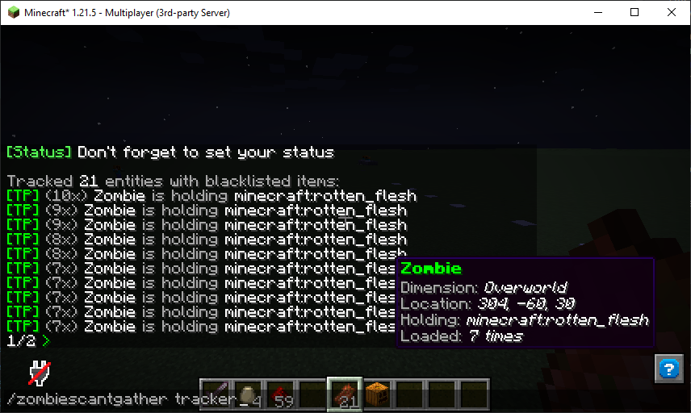

# Zombies Can't Gather

[![Modrinth Downloads](https://img.shields.io/modrinth/dt/683FasTt?label=modrinth&logo=data:image/svg+xml;base64,PHN2ZyB4bWxucz0iaHR0cDovL3d3dy53My5vcmcvMjAwMC9zdmciIHZpZXdCb3g9IjAgMCAxMSAxMSIgd2lkdGg9IjE0LjY2NyIgaGVpZ2h0PSIxNC42NjciICB4bWxuczp2PSJodHRwczovL3ZlY3RhLmlvL25hbm8iPjxkZWZzPjxjbGlwUGF0aCBpZD0iQSI+PHBhdGggZD0iTTAgMGgxMXYxMUgweiIvPjwvY2xpcFBhdGg+PC9kZWZzPjxnIGNsaXAtcGF0aD0idXJsKCNBKSI+PHBhdGggZD0iTTEuMzA5IDcuODU3YTQuNjQgNC42NCAwIDAgMS0uNDYxLTEuMDYzSDBDLjU5MSA5LjIwNiAyLjc5NiAxMSA1LjQyMiAxMWMxLjk4MSAwIDMuNzIyLTEuMDIgNC43MTEtMi41NTZoMGwtLjc1LS4zNDVjLS44NTQgMS4yNjEtMi4zMSAyLjA5Mi0zLjk2MSAyLjA5MmE0Ljc4IDQuNzggMCAwIDEtMy4wMDUtMS4wNTVsMS44MDktMS40NzQuOTg0Ljg0NyAxLjkwNS0xLjAwM0w4LjE3NCA1LjgybC0uMzg0LS43ODYtMS4xMTYuNjM1LS41MTYuNjk0LS42MjYuMjM2LS44NzMtLjM4N2gwbC0uMjEzLS45MS4zNTUtLjU2Ljc4Ny0uMzcuODQ1LS45NTktLjcwMi0uNTEtMS44NzQuNzEzLTEuMzYyIDEuNjUxLjY0NSAxLjA5OC0xLjgzMSAxLjQ5MnptOS42MTQtMS40NEE1LjQ0IDUuNDQgMCAwIDAgMTEgNS41QzExIDIuNDY0IDguNTAxIDAgNS40MjIgMCAyLjc5NiAwIC41OTEgMS43OTQgMCA0LjIwNmguODQ4QzEuNDE5IDIuMjQ1IDMuMjUyLjgwOSA1LjQyMi44MDljMi42MjYgMCA0Ljc1OCAyLjEwMiA0Ljc1OCA0LjY5MSAwIC4xOS0uMDEyLjM3Ni0uMDM0LjU2bC43NzcuMzU3aDB6IiBmaWxsLXJ1bGU9ImV2ZW5vZGQiIGZpbGw9IiM1ZGE0MjYiLz48L2c+PC9zdmc+)](https://modrinth.com/mod/zombies-cant-gather)


A Minecraft mod that prevents Zombies from picking up any item you choose!

Since 1.17.1 there's a check in the game to prevent zombies from gathering glow ink sacs. 
Zombies Can't Gather changes that line to check against a blacklist, loaded from the config. 
Zombies are not able to pick up blacklisted items, which prevents them from becoming persistent.

Now with support for Piglins!

> By default, the mod only prevents Zombies from gathering `minecraft:glow_ink_sac`, just like vanilla Minecraft.

## Tracker

The tracker in Zombies Can't Gather logs of every time a mob holding a blacklisted item is loaded so you can 
use a command to see where all those persistent mobs are. When turned on, running the command
`/zombiescantgather tracker` will show information about those mobs, like the item they are holding and
the amount of times the mob has been loaded.



When the player has the `zombiescantgather.tracker.teleport` command, they will see a clickable button to 
teleport to the mob too. The teleport also works for mobs in unloaded chunks.

Running `/zombiescantgather tracker reset` will clear the list, so you can start fresh.

### Enabling the tracker

To turn on the tracker, set enable_tracker in the config to true:

```properties
# Enable/disable tracker
enable_tracker=true
```

## Configuring the blacklists

The `/zombiescantgather` command has options to add/remove/list items that a Zombie can't pick up. The
command will give you suggestions for the items you want to add to the list.

The `/zombiescantgather` command has a list for both zombies and piglins:
```properties
/zombiescantgather zombie
/zombiescantgather piglin
```

Zombies and piglins can not pick up any items on their list. To add items to the list you can use the commands:
```properties
/zombiescantgather zombie add minecraft:rotten_flesh
/zombiescantgather piglin add minecraft:rotten_flesh
```
And of course you can also remove items from the lists so the zombies and piglins can pick up the items again:

```properties
/zombiescantgather zombie remove minecraft:rotten_flesh
/zombiescantgather piglin remove minecraft:rotten_flesh
```
The item ids are provided as command suggestions, so you don't need to worry about the names.

If you added weird stuff and want to start over, use the reset commands:
```properties
/zombiescantgather zombie reset
/zombiescantgather piglin reset
```

## Manual configuration

The list of items a Zombie can't pick up is stored in a config file: `config/zombiescantgather/mod.properties`:

```properties
zombiescantgather_items=minecraft\:glow_ink_sac,minecraft\:rotten_flesh,minecraft\:egg,minecraft\:bone
piglinscantgather_items=minecraft\:rotten_flesh,minecraft\:egg
```
Items are a comma separated value with escaped colons.

